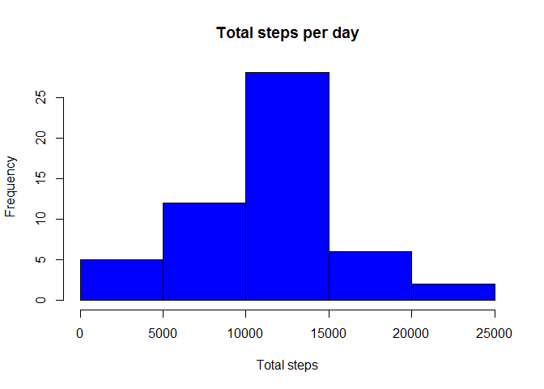
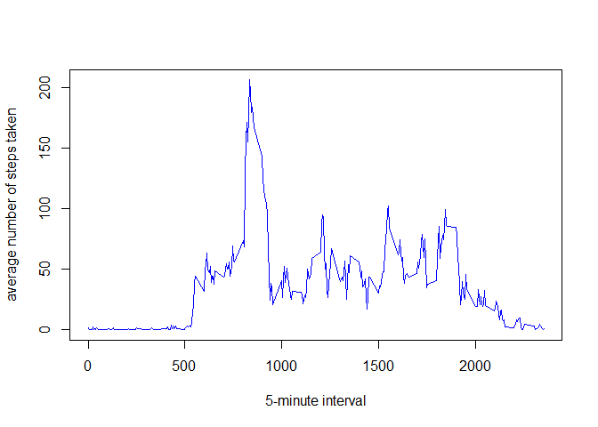
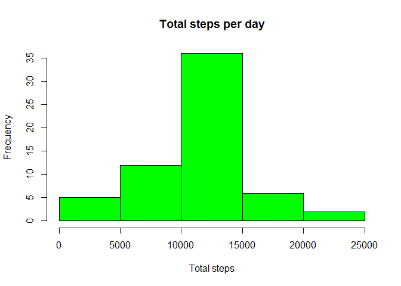
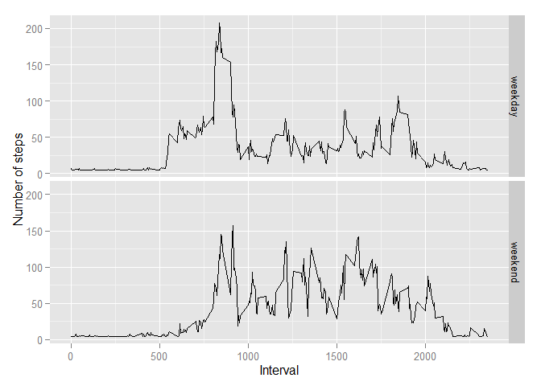

# Reproducible Research: Peer Assessment 1


## Loading and preprocessing the data

```r
unzip("activity.zip")
activity_data = read.csv("activity.csv")
head(activity_data)
```

```
##   steps       date interval
## 1    NA 2012-10-01        0
## 2    NA 2012-10-01        5
## 3    NA 2012-10-01       10
## 4    NA 2012-10-01       15
## 5    NA 2012-10-01       20
## 6    NA 2012-10-01       25
```


```r
names(activity_data)
```

```
## [1] "steps"    "date"     "interval"
```


```r
library(ggplot2)
```

```
## Warning: package 'ggplot2' was built under R version 3.1.3
```

```r
library(Hmisc)
```

```
## Warning: package 'Hmisc' was built under R version 3.1.3
```

```
## Loading required package: grid
## Loading required package: lattice
## Loading required package: survival
## Loading required package: splines
## Loading required package: Formula
```

```
## Warning: package 'Formula' was built under R version 3.1.3
```

```
## 
## Attaching package: 'Hmisc'
## 
## The following objects are masked from 'package:base':
## 
##     format.pval, round.POSIXt, trunc.POSIXt, units
```

## What is mean total number of steps taken per day?
1. Make a histogram of the total number of steps taken each day

```r
total_steps = aggregate(steps ~ date, data = activity_data, FUN=sum, na.rm = TRUE)
hist(total_steps$steps, main = "Total steps per day", xlab = "Total steps", col = "blue")
```

 
3. Mean and median of the total number of steps taken per day

```r
mean(total_steps$steps)
```

```
## [1] 10766.19
```

```r
median(total_steps$steps)
```

```
## [1] 10765
```

## What is the average daily activity pattern?
1.Make a time series plot

```r
average_steps = aggregate(steps ~ interval, data = activity_data, FUN = mean, na.rm=TRUE)
plot(average_steps,col= "blue", type = "l", xlab="5-minute interval", ylab="average number of steps taken")
```

 
2.Which 5-minute interval, on average across all the days in the dataset, contains the maximum number of steps?

```r
average_steps$interval[which.max(average_steps$steps)]
```

```
## [1] 835
```

##Imputing missing values
1.Calculate and report the total number of missing values in the dataset (i.e. the total number of rows with NAs)

```r
total_missing_values = length(which(is.na(activity_data$steps)))
head(total_missing_values)
```

```
## [1] 2304
```

```r
summary(activity_data$steps)
```

```
##    Min. 1st Qu.  Median    Mean 3rd Qu.    Max.    NA's 
##    0.00    0.00    0.00   37.38   12.00  806.00    2304
```
1.Devise a strategy for filling in all of the missing values in the dataset. The strategy does not need to be sophisticated. For example, you could use the mean/median for that day, or the mean for that 5-minute interval.
*I'll use mean steps for a five-minute interval for the entire dataset by calling (library Hmisc)

2.Create a new dataset that is equal to the original dataset but with the missing data filled in.

```r
activity_data.new = activity_data
activity_data.new$steps = with(activity_data.new, impute(steps, mean))
```
4. Make a histogram of the total number of steps taken each day and Calculate and report the mean and median total number of steps taken per day. Do these values differ from the estimates from the first part of the assignment? What is the impact of imputing missing data on the estimates of the total daily number of steps?

```r
new.total_steps = aggregate(steps ~ date, data = activity_data.new, FUN=sum, na.rm = TRUE)
#Histogram for the missing value imputed  is
hist(new.total_steps$steps, main = "Total steps per day", xlab = "Total steps", col = "green")
```

 

Mean and median for the missing value imputed dataset are:

```r
mean(new.total_steps$steps)
```

```
## [1] 10766.19
```

```r
median(new.total_steps$steps)
```

```
## [1] 10766.19
```
* After imputing missing data mean remained the same but median total number of daily steps has been increased  a little bit, and even by looking in the histograms after imputing missing values, the estimates of the total daily number of steps has been increased.

##Are there differences in activity patterns between weekdays and weekends?
1.To Create a new factor variable in the dataset with two levels - "weekday" and "weekend" indicating whether a given date is a weekday or weekend day.

```r
activity_data.new$dateType=ifelse(as.POSIXlt(activity_data.new$date)$wday %in% c(0,6), 'weekend', 'weekday')
```
2. To make a panel plot containing a time series plot (i.e. type = "l") of the 5-minute interval (x-axis) and the average number of steps taken

```r
average.imputed.data = aggregate(steps ~ interval + dateType, data=activity_data.new, mean)
ggplot(average.imputed.data,  type="l", main="Average Steps by 5-minute Interval for Weekends and Weekdays", aes(interval, steps)) + geom_line() + facet_grid(dateType ~ .)+ xlab("Interval") + ylab("Number of steps")
```

 
